# openrouter-agent-bench

A production-grade, model-agnostic LLM benchmarking harness for OpenRouter models, with a built-in web dashboard ("ox-alpha harness").

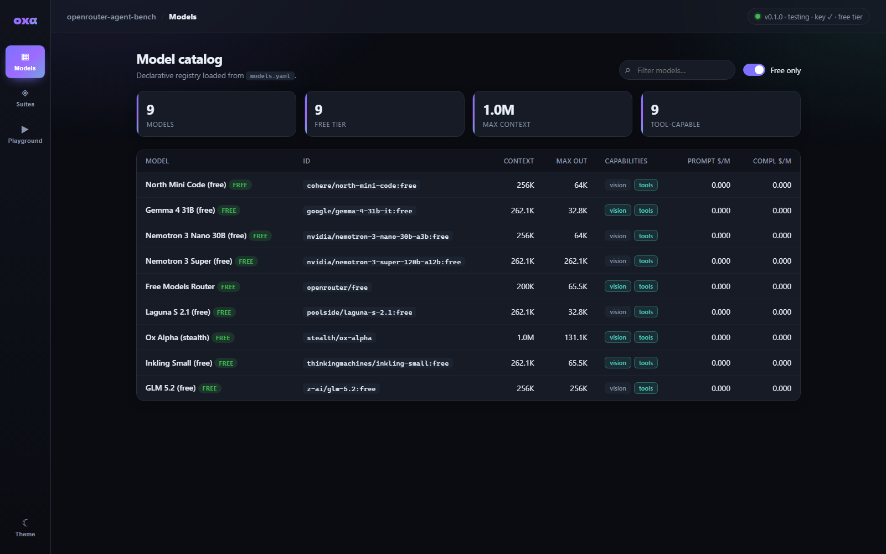

## Features

- **Async OpenRouter client** — OpenAI-compatible chat completions with tenacity-based retries (429/5xx-aware, honors `Retry-After`), SSE streaming, and cost estimation from a local pricing table.
- **Model registry** — declarative catalog in `models.yaml` (context windows, capabilities, per-million-token pricing).
- **Task suites** — pydantic-validated benchmark tasks in `tasks/suites/` with pluggable graders: `exact_match`, `unit_tests` (sandboxed pytest), `llm_judge`, and `keyed_facts`. Ships three suites: `coding` (bug-fix / refactor, sandboxed tests), `agentic` (single-turn planning, tool-selection, debugging), and `long_context` (needle-in-haystack retrieval).
- **Sandboxed execution** — subprocess runner with network blocking and environment sanitization.
- **Web dashboard** — FastAPI backend + single-page frontend for browsing models/suites and chatting with any registered model through the client.

## Installation

Requires Python 3.11+ and [uv](https://docs.astral.sh/uv/):

```bash
uv sync
```

## Configuration

Copy `.env.example` to `.env` and fill in your values:

```bash
cp .env.example .env
```

| Variable | Required | Description |
| --- | --- | --- |
| `OPENROUTER_API_KEY` | yes | OpenRouter API key ([get one here](https://openrouter.ai/keys)) |
| `OPENROUTER_BASE_URL` | no | API base URL override (default: `https://openrouter.ai/api/v1`) |
| `OAB_SUITES_DIR` | no | Task-suite root directory (default: `<repo>/tasks/suites`) |
| `OAB_MODELS_FILE` | no | Model catalog YAML path (default: `<repo>/models.yaml`) |
| `OAB_SERVER_HOST` | no | Web server bind host (default: `127.0.0.1`) |
| `OAB_SERVER_PORT` | no | Web server port (default: `8420`) |
| `OAB_TESTING` | no | Set to `1` to enable offline/testing mode |
| `OAB_FREE_MODELS_ONLY` | no | Restrict testing to free models (default: `1`) |

`.env` files are loaded automatically by the test suite and the web server; real environment variables always take precedence over `.env` values.

### Free-tier mode

By default (`OAB_FREE_MODELS_ONLY=1`) the harness only tests **free models** — entries in `models.yaml` with a `:free` id suffix or zero pricing (verified live against the OpenRouter catalog). In this mode:

- `/api/models` returns free models only (override per-request with `?free_only=false`)
- `/api/chat` rejects paid models with HTTP 400
- The dashboard shows a **Free models only** toggle and FREE badges

Set `OAB_FREE_MODELS_ONLY=0` to include paid models; they remain listed for reference either way.

## Command-line interface

The `bench` CLI runs suites against models, persists results, and reports them.

```bash
uv run bench --help                       # list commands
uv run bench models                       # free model catalog (--all for paid)
uv run bench suites --suite coding        # browse tasks in a suite
uv run bench validate                     # validate every suite/task file

# Run the coding suite against a model, storing results to SQLite:
uv run bench run coding --model stealth/ox-alpha
uv run bench run coding -m stealth/ox-alpha --task binary-search-boundary -n 3
uv run bench run coding -m stealth/ox-alpha --limit 4 --label smoke

# Re-report a stored run as a table, Markdown, and/or a pass-rate chart:
uv run bench report                       # latest run, console tables
uv run bench report --run 1 --markdown report.md --plot passrates.png
```

`bench run` requires `OPENROUTER_API_KEY`. Paid models are rejected while
`OAB_FREE_MODELS_ONLY=1`. Results are written to `bench_results.db` by default
(override with `--db`, or skip persistence with `--no-store`). `unit_tests`
tasks are graded by executing the hidden pytest files inside the sandbox.

## Example results

A run of all three suites against the live free-tier models. Aggregates are in
[`reports/results.json`](reports/results.json).

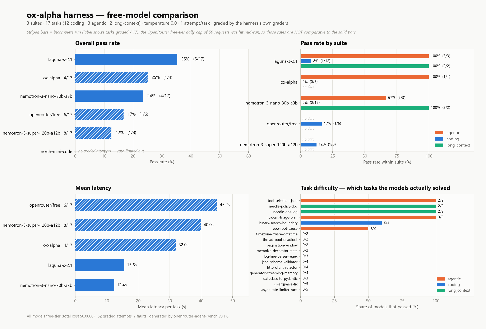

| Model | Pass rate | Coverage |
| --- | --- | --- |
| `poolside/laguna-s-2.1:free` | **35%** (6/17) | complete |
| `stealth/ox-alpha` | 25% (1/4) | partial |
| `nvidia/nemotron-3-nano-30b-a3b:free` | 24% (4/17) | complete |
| `openrouter/free` | 17% (1/6) | partial |
| `nvidia/nemotron-3-super-120b-a12b:free` | 12% (1/8) | partial |
| `cohere/north-mini-code:free` | — | no graded attempts |

Conditions: temperature 0.0, one attempt per task, $0.00 total cost.

Two caveats on these numbers:

- **The run is incomplete.** The OpenRouter free tier caps you at 50 requests per
  day, and that cap was reached mid-run. Only two models finished all 17 tasks;
  the striped bars in the chart mark the partial ones and are labelled with the
  task count they actually cover, since a rate over 4 tasks is not comparable to
  one over 17. Three further catalogued models never ran at all — two returned
  upstream 429s and `thinkingmachines/inkling-small:free` returns 403
  (`only available on agentic harnesses`).
- **The low `coding` scores are genuine model failures, not grader faults.** The
  suites split sharply: 67–100% on `agentic` and `long_context` against 0–8% on
  `coding`. Spot-checking the stored failures shows real assertion failures and
  submitted code that fails to import, not extraction or sandbox problems.

## Web dashboard

```bash
uv run bench-web
```

Then open <http://127.0.0.1:8420>. The dashboard provides:

- **Models** — catalog table with context windows, vision/tool support, and pricing.
- **Suites** — task browser with difficulty ratings and prompt inspection (hidden grader material is never exposed by the API).
- **Playground** — chat with any registered model through the retrying OpenRouter client, with token/cost/latency reporting.

### Screenshots

**Suites** — pick a suite, then click any task to inspect the exact prompt the model receives:

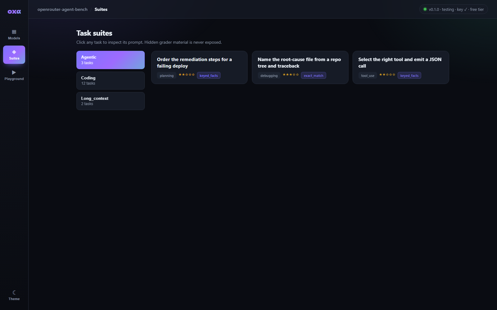

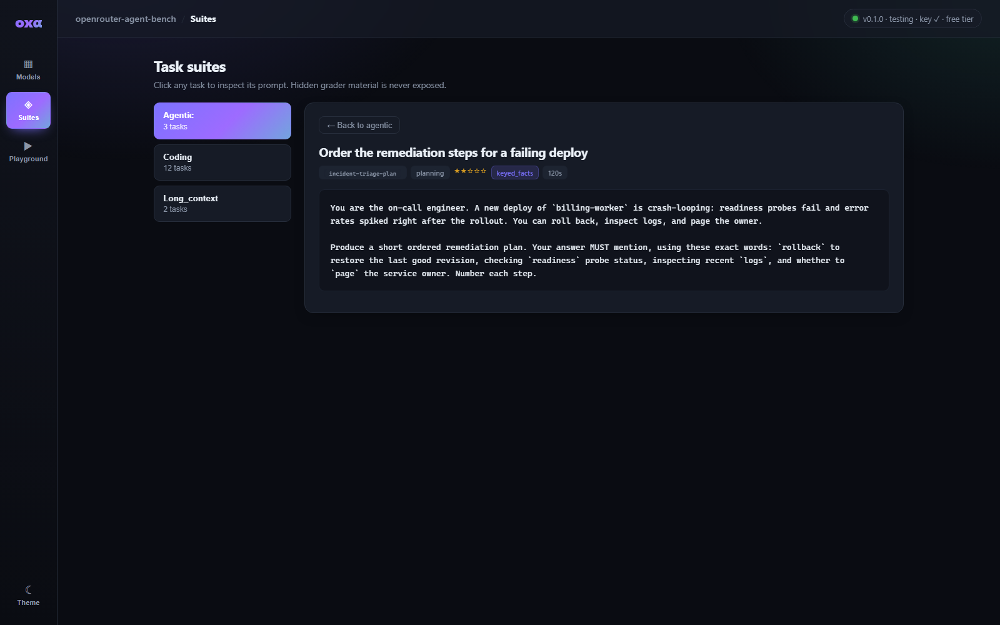

**Playground** — chat with any registered model; the footer reports tokens, cost, latency and finish reason:

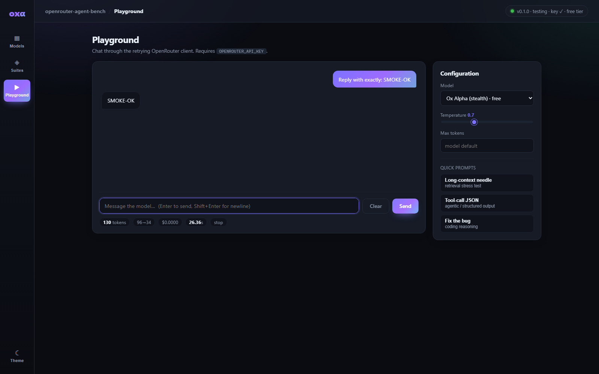

<details>
<summary>More screenshots — filtering, paid models, light theme, mobile</summary>

<br />

Filter the catalog by name:

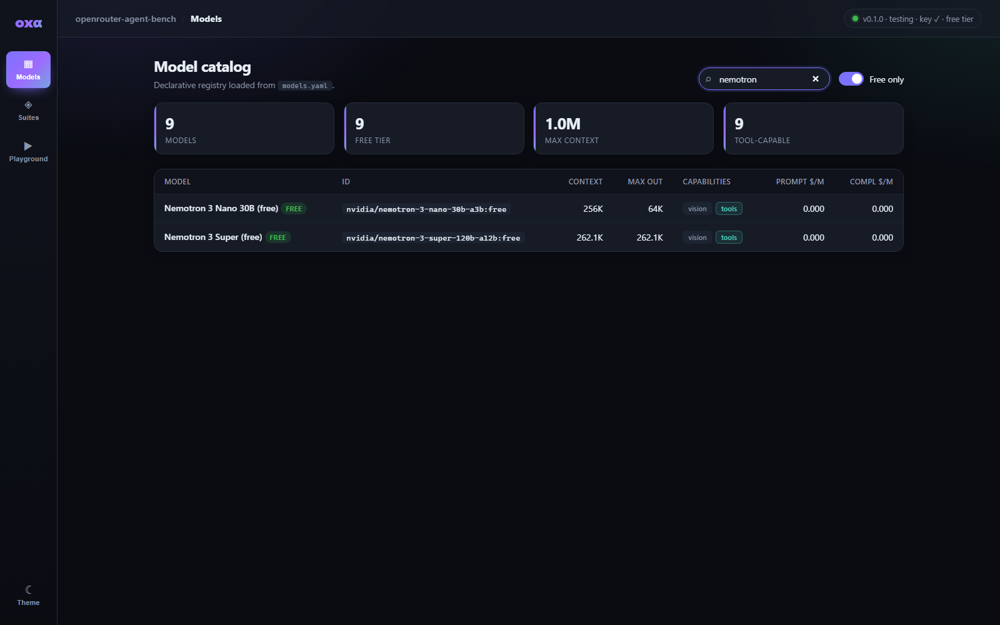

Toggle **Free only** off to reveal the paid reference models (9 → 13 entries):

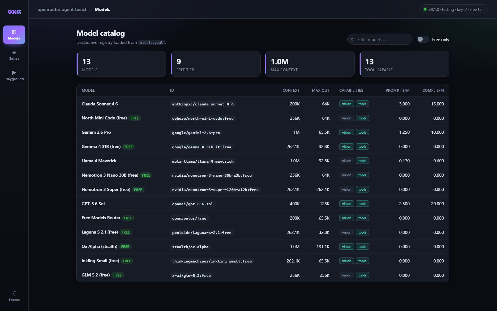

The `coding` and `long_context` suites:

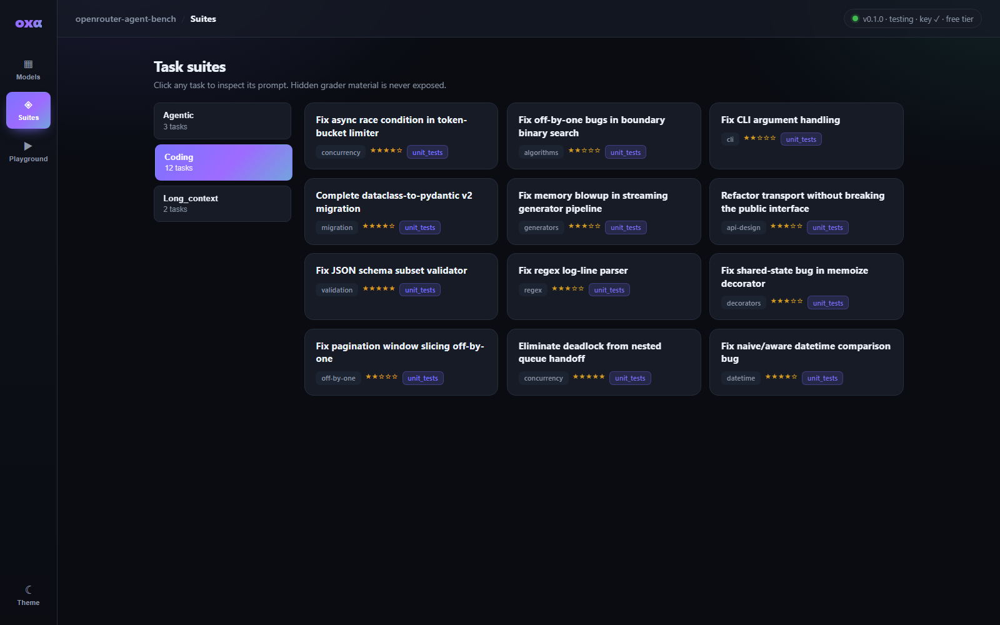

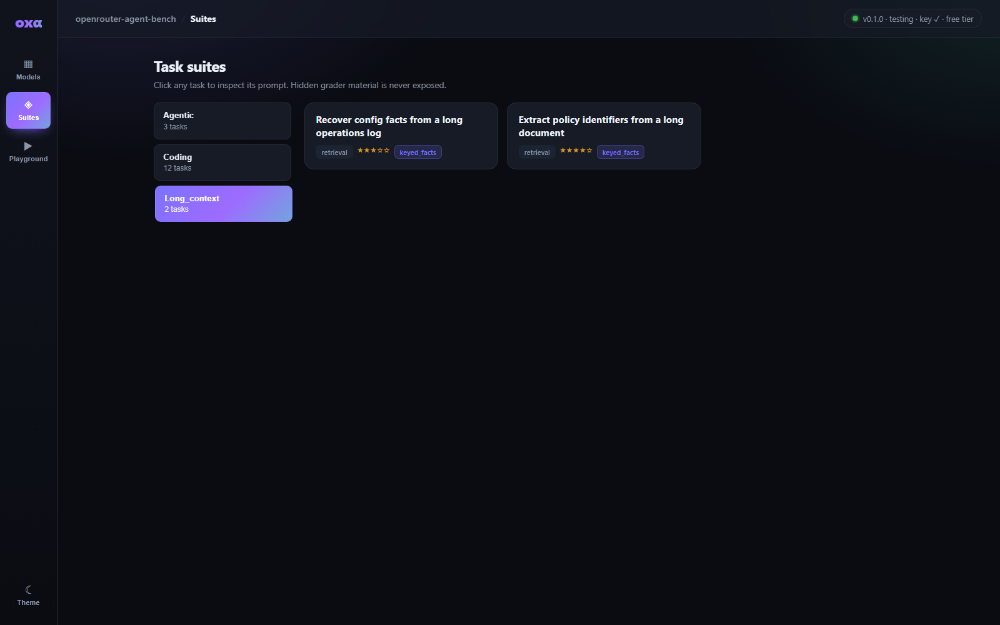

Playground before the first message:

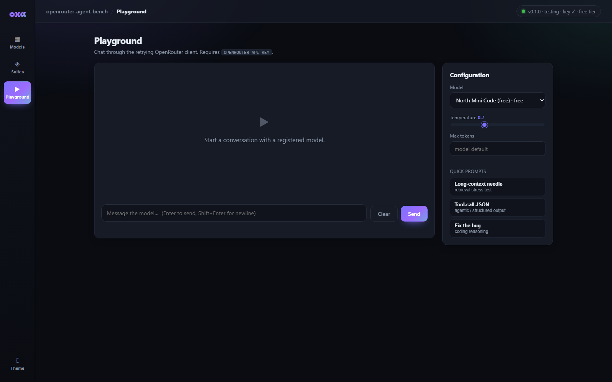

Light theme:

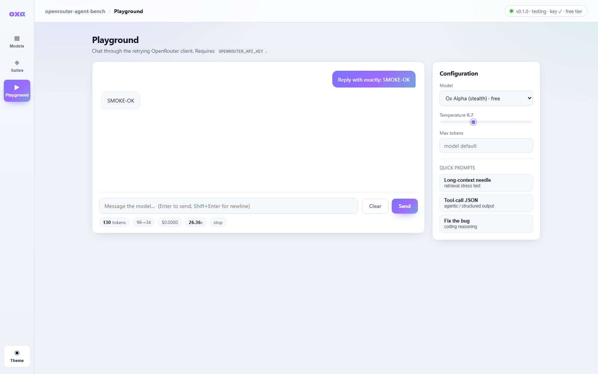

Responsive layout at 430px:

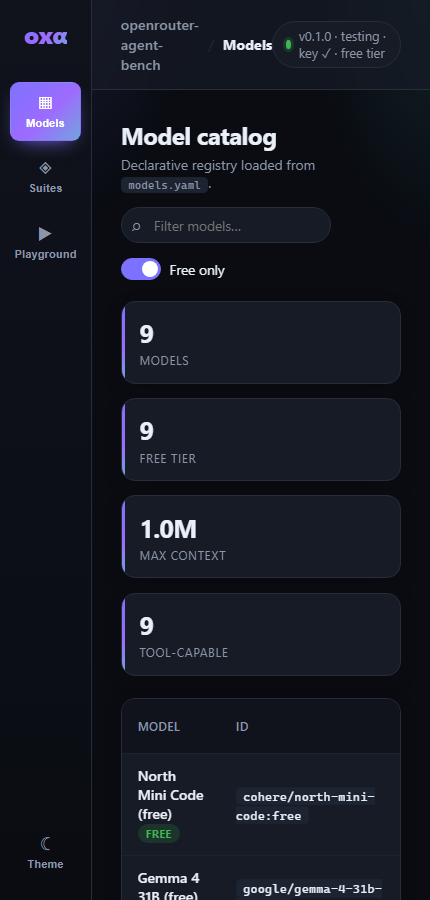

</details>

### HTTP API

| Endpoint | Method | Description |
| --- | --- | --- |
| `/api/health` | GET | Liveness + configuration summary |
| `/api/models` | GET | Model catalog from `models.yaml` |
| `/api/suites` | GET | Loaded task suites (grader internals stripped) |
| `/api/chat` | POST | Chat completion proxy (`{model, messages, temperature?, max_tokens?}`) |

Interactive docs are available at `/docs`.

## Project layout

```
src/openrouter_agent_bench/
├── agent/         # Benchmark runner (task → model → grade)
├── cli/           # `bench` Typer CLI (run, report, models, suites, validate)
├── client/        # Async OpenRouter client, schemas, cost estimation
├── config.py      # .env loading + Settings facade
├── evaluation/    # Graders (exact_match, unit_tests, llm_judge, keyed_facts)
├── models/        # Model registry (models.yaml)
├── reporting/     # Result aggregation, tables, Markdown + plots
├── sandbox/       # Sandboxed subprocess execution
├── server/        # FastAPI app + static web dashboard
├── storage/       # SQLite results store (SQLModel)
└── tasks/         # TaskSpec schema + suite loading/validation

reports/           # Generated charts, dashboard screenshots, aggregated results
tasks/suites/      # Benchmark task definitions (coding, agentic, long_context)
```

## Development

```bash
uv run pytest          # run tests
uv run ruff check src tests   # lint
uv run mypy src        # type-check
```

## License

MIT — see [LICENSE](LICENSE).
